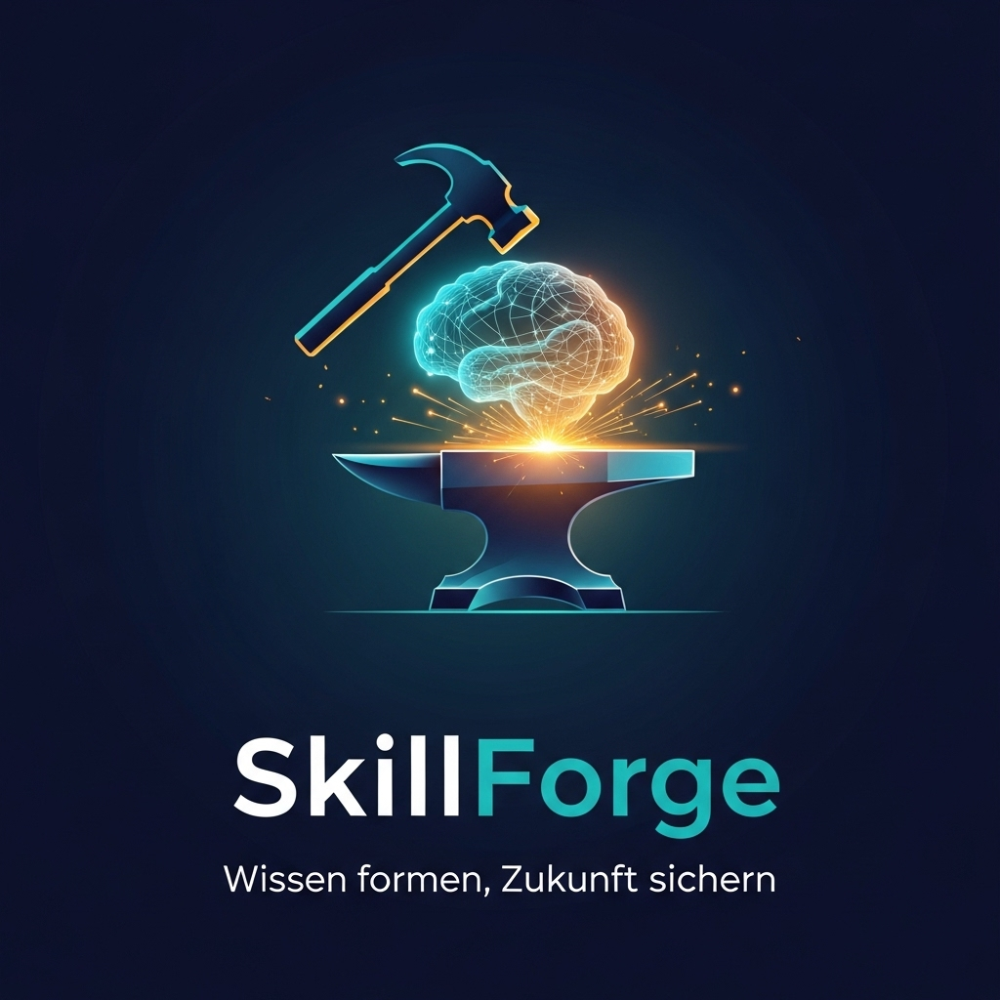
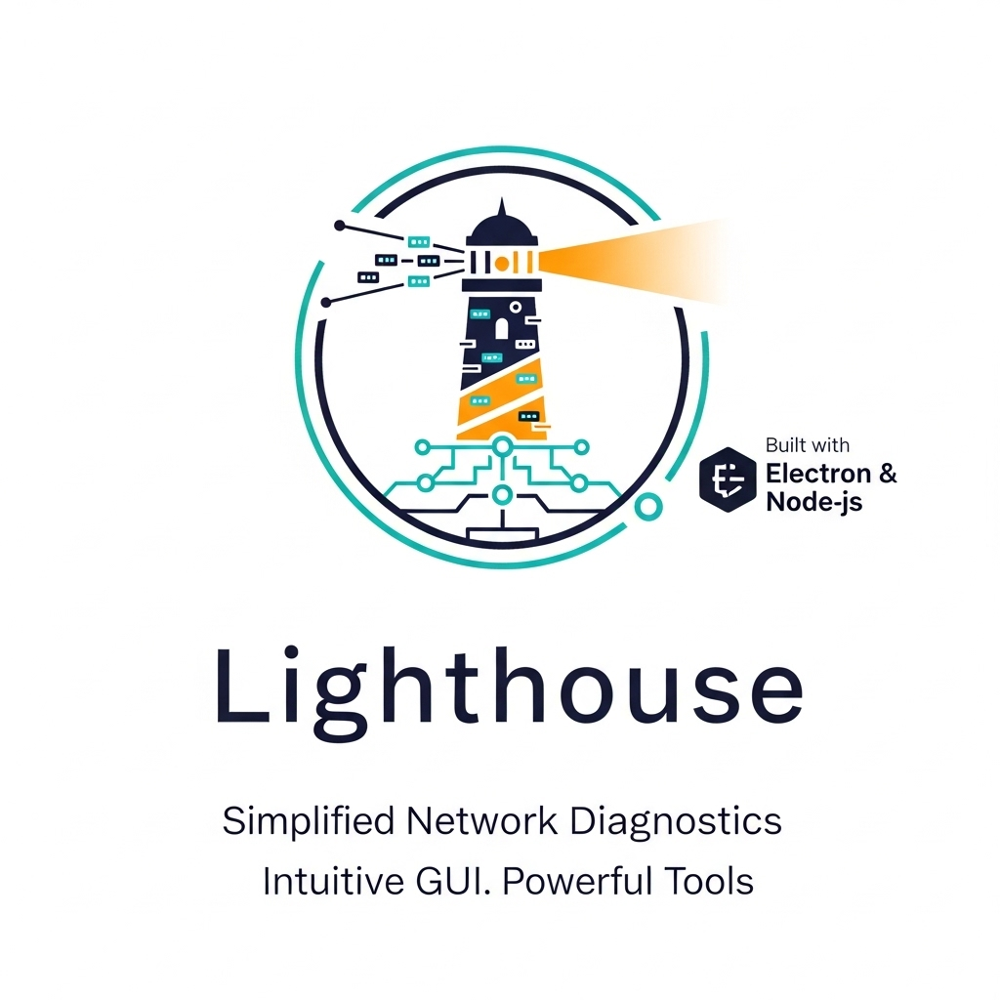
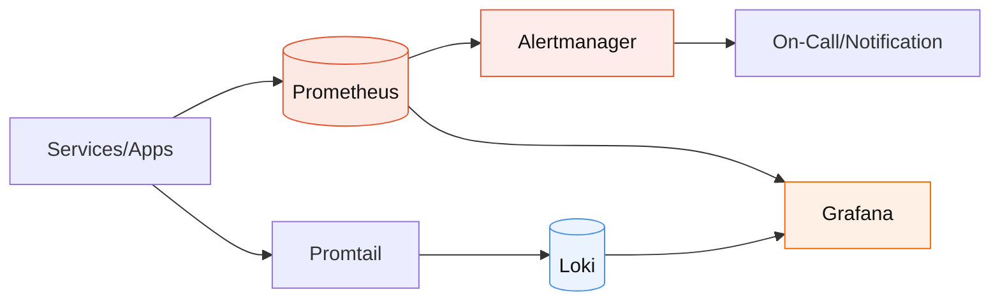

<!-- Fancy Header -->

  

  

---

  Willkommen auf meinem digitalen Campus. Hier verbinde ich Code mit Kreativität und strategischem Denken, um robuste und intelligente Lösungen zu entwickeln.

---

## Über mich

- 🚀 Aktuell baue ich ein **Skill-Portfolio** mit Fokus auf **Sicherheit, Automatisierung** und **durchdachte Software-Architekturen**.  
- 💡 Ich verbinde technische Expertise mit **Philosophie**, **Psychologie** und kreativen Hobbys wie **Klavier**, **Zeichnen** und **Lesen**.  
- ✍️ <strong>Autor</strong>: <em>Unter demselben Himmel</em> (Debütroman).

---

## 🛠 Tech Stack & Skills

  
  
  
  
  
  
  

---

## 🤖 AI-Enhanced Development

> Von Daten zu Entscheidungen: RAG-Pipelines, Agenten & Multimodalität – beschleunigt mit Claude Opus & OpenAI.

  <!-- Modelle & Provider -->
  
  
  

  <!-- Serving, MLOps & Observability -->
  
  
  
  
  

---

## 🚀 Projekte

<table>
  <tr>
    <td colspan="2">
      <h3 align="center">SkillForge: Adaptives IHK-Lern-Ökosystem</h3>
      

        
      

      

        <strong>SkillForge</strong> ist eine progressive Web-App zur gezielten Vorbereitung auf IHK-Abschlussprüfungen für Fachinformatiker.  
        Es basiert auf einem <strong>psychologisch fundierten 3-Phasen-Modell</strong> (Wissensaufnahme → Praxistransfer → Überprüfung) und bietet <strong>adaptive Lernpfade</strong>, Spaced-Repetition-Logik und realitätsnahe Szenarien (Subnetting, Nutzwertanalyse, Netzpläne).
      

      

        <strong>Architektur:</strong> Modularer ES6-Code, UI-State-Management, vorbereitet für MongoDB/Mongoose.
      

    </td>
  </tr>
  <tr>
    <td width="50%" valign="top">
      <h3 align="center">GameGuard: Secure Your Play</h3>
      

        
      

      

        Ein Desktop-Tool für eine sichere Spielumgebung: automatisierter VPN-Tunnel (WireGuard/OpenVPN), Firewall-Isolation und Kill-Switch.
      

      
<strong>Tech:</strong> Electron, Node.js, PowerShell

    </td>
    <td width="50%" valign="top">
      <h3 align="center">Project Lighthouse</h3>
      

        
      

      

        Ein All-in-One-Diagnosewerkzeug mit Netzwerkbefehlen, LAN-Scanner, Live-Diagnose und geführter Fehlersuche.
      

      
<strong>Tech:</strong> Electron, Node.js, HTML, CSS

    </td>
  </tr>
</table>

---

## ⚙️ Architektur-Notiz aus einem aktuellen Projekt: Von Ereignis zu Erkenntnis (Prometheus • Loki • Grafana)

---

## 🐍 Contribution Snake

  <picture>
    <source media="(prefers-color-scheme: dark)" srcset="https://raw.githubusercontent.com/nakzyhyh/nakzyhyh/output/snake-dark.svg" />
    <source media="(prefers-color-scheme: light)" srcset="https://raw.githubusercontent.com/nakzyhyh/nakzyhyh/output/snake-light.svg" />
    
  </picture>

---

## 📫 Kontakt

  
  

  

